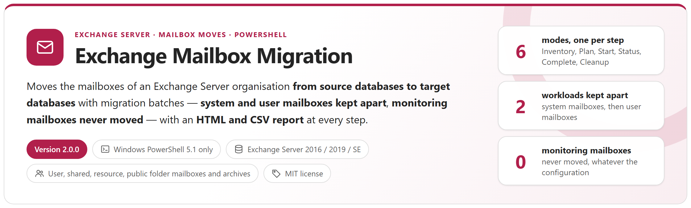
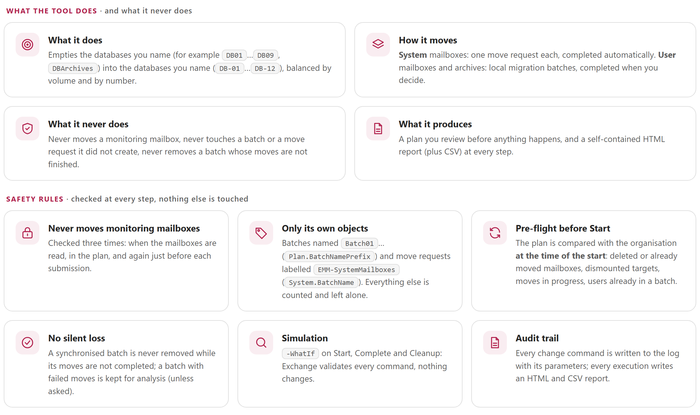
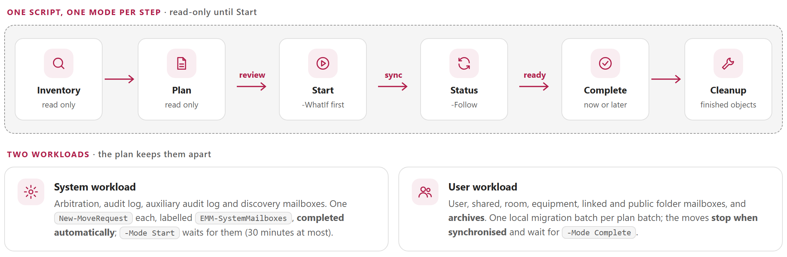
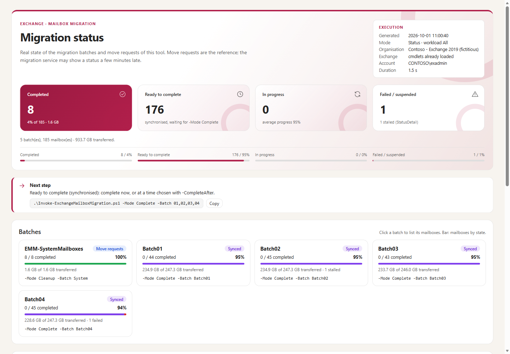

<p align="center">
  <picture>
    <source media="(prefers-color-scheme: dark)" srcset="package/docs/images/readme-banner-dark.png">
    
  </picture>
</p>

<p align="center">
  <a href="#why"><b>Why</b></a> &nbsp;&middot;&nbsp;
  <a href="#how-it-works"><b>How it works</b></a> &nbsp;&middot;&nbsp;
  <a href="#reports"><b>Reports</b></a> &nbsp;&middot;&nbsp;
  <a href="#quick-start"><b>Quick start</b></a> &nbsp;&middot;&nbsp;
  <a href="package/docs/ExchangeMailboxMigration-UserGuide.md"><b>User guide</b></a> &nbsp;&middot;&nbsp;
  <a href="package/docs/ExchangeMailboxMigration-Guide.md"><b>Developer guide</b></a>
</p>

> [!IMPORTANT]
> Files downloaded from the Internet may be blocked by Windows and fail to run. Before using this project, unblock every file in the downloaded folder:
>
> ```powershell
> Get-ChildItem "C:\Chemin\Du\Dossier" -Recurse -File -Force | Unblock-File
> ```
>
> Replace the example path with the folder where you downloaded or extracted this project.
>
> The `Install-Module` commands in this documentation use `-Force`, so they also update or reinstall a module that is already installed. If an older version still conflicts, close every PowerShell window, open a new one (as administrator for `-Scope AllUsers`), run `Uninstall-Module <ModuleName> -AllVersions -Force`, then run the `Install-Module` command again.

## Why

Replacing mailbox databases (new servers, new storage, new naming) means emptying the old databases: user, shared and resource mailboxes, archives, public folder mailboxes, and the system mailboxes. With hundreds or thousands of mailboxes the moves must be **planned** (target database, balanced batches), **checked** before they start, **followed**, **completed at a chosen time** and **cleaned up** — without ever touching what does not belong to the migration.

<picture>
  <source media="(prefers-color-scheme: dark)" srcset="package/docs/images/readme-principles-dark.png">
  
</picture>

## How it works

<picture>
  <source media="(prefers-color-scheme: dark)" srcset="package/docs/images/readme-how-it-works-dark.png">
  
</picture>

- **One script, one mode per step**, everything set in one configuration file: which databases are emptied, which are filled, which mailbox types, how many batches.
- **System workload** (arbitration, audit log, discovery): one move request per mailbox, completed automatically. **User workload** (user, shared, room, equipment, linked, public folder mailboxes and archives): local migration batches that stop when synchronised and are completed when you decide.
- **Balanced plan**: target databases by volume (existing data counted), batches of equal volume and size; archive-only and primary-only moves handled explicitly.
- **Safe by design**: pre-flight against the live organisation before any start, confirmation before every change, `-WhatIf` simulation, never touches batches or move requests of other tools, never removes a batch whose moves are not completed, never moves a monitoring mailbox.
- **Reports**: self-contained HTML (filters, details, export) and CSV for every execution; every change command in the log.

## Reports

<table>
  <tr>
    <td width="50%" valign="top"><a href="package/docs/images/report-inventory.png"></a><br><sub><b>Inventory</b> &middot; the source databases read as they are: how many mailboxes to move, how many are system and how many are user, and what stays behind with the reason (monitoring mailboxes)</sub></td>
    <td width="50%" valign="top"><a href="package/docs/images/report-plan.png"></a><br><sub><b>Plan</b> &middot; what would happen before anything happens: mailboxes and volume per batch, the target databases chosen, and the command of the next step</sub></td>
  </tr>
  <tr>
    <td width="50%" valign="top"><a href="package/docs/images/report-status.png"></a><br><sub><b>Status</b> &middot; one card per batch: completed, ready to complete and failed moves, with the command that completes the batch</sub></td>
    <td width="50%" valign="top"><a href="package/docs/images/report-status-details.png"></a><br><sub><b>Details</b> &middot; click a mailbox: its status, its sizes, its source and target database, and the error text when a move failed</sub></td>
  </tr>
  <tr>
    <td width="50%" valign="top"><a href="package/docs/images/console-start.png"></a><br><sub><b>Start in the console</b> &middot; the plan read, the connection, the pre-flight decisions, the confirmation, the submission and the report that follows</sub></td>
    <td width="50%" valign="top"><a href="package/docs/images/console-complete.png"></a><br><sub><b>Complete in the console</b> &middot; the synchronised batches, the confirmation, then the completion commands sent to Exchange</sub></td>
  </tr>
</table>

## Requirements

| Item | Requirement |
|---|---|
| Exchange | Exchange Server 2019 / Subscription Edition (2016 works: same cmdlets), moves inside one organisation |
| PowerShell | **Windows PowerShell 5.1 only** (Exchange Management Shell, or `powershell.exe`). PowerShell 7 is not supported by Microsoft for Exchange Server management: the script refuses it |
| Permissions | RBAC roles Mail Recipients, Move Mailboxes, Migration, View-Only Configuration (e.g. Organization Management) |
| Console | Windows Terminal for emoji and colours; the classic console shows symbols |

## Quick start

```powershell
git clone https://github.com/Nico77600/ExchangeMailboxMigration.git
cd ExchangeMailboxMigration\package
notepad .\config\ExchangeMailboxMigration.config.psd1      # Databases: source and target patterns

.\Invoke-ExchangeMailboxMigration.ps1                                   # inventory: changes nothing
.\Invoke-ExchangeMailboxMigration.ps1 -Mode Plan  -Workload System
.\Invoke-ExchangeMailboxMigration.ps1 -Mode Start -Workload System -WhatIf
.\Invoke-ExchangeMailboxMigration.ps1 -Mode Start -Workload System
.\Invoke-ExchangeMailboxMigration.ps1 -Mode Plan  -Workload User
.\Invoke-ExchangeMailboxMigration.ps1 -Mode Start -Workload User
.\Invoke-ExchangeMailboxMigration.ps1 -Mode Status -Follow
.\Invoke-ExchangeMailboxMigration.ps1 -Mode Complete -Batch 01,02 -CompleteAfter '2026-10-03 22:00'
.\Invoke-ExchangeMailboxMigration.ps1 -Mode Cleanup
```

The `package` folder of the repository holds exactly the files needed to run, with both guides: copy it to an Exchange server. The zip of each [release](https://github.com/Nico77600/ExchangeMailboxMigration/releases) contains the same run-time files with the HTML guides; `.\tools\New-EmmPackage.ps1` builds that zip content from the repository.

## Documentation

| Guide | Content |
|---|---|
| **[User guide](package/docs/ExchangeMailboxMigration-UserGuide.md)** | **The path, step by step**: the prerequisites (Exchange Server, Windows PowerShell 5.1, the RBAC roles), the one-time setup of the configuration file, then the inventory, the system mailboxes, the plan, the simulation and the start, how to follow the moves, how to complete them at a chosen time and how to clean up — each step with the command to copy and what to check; then the reports and the files of a run, and what to do when something looks wrong. |
| **[Developer guide](package/docs/ExchangeMailboxMigration-Guide.md)** | Everything else: the concepts and the two workloads, the safety rules, the installation, every key of the configuration, the parameters of the script, the step-by-step reference with screenshots, the recipes, the reports, the exit codes and the files, the code map and the internals, the tests, and the annexes (troubleshooting, Exchange cmdlets, the plan file). |

Both guides also exist as a single HTML file with a light and a dark theme (`package/docs/ExchangeMailboxMigration-UserGuide.html`, `package/docs/ExchangeMailboxMigration-Guide.html`): download them and open them locally, or use the copies in the release zip.

## Tests

```powershell
# Windows PowerShell 5.1 (powershell.exe), like the tool; Pester 5+ installed (Windows ships 3.4)
Invoke-Pester -Path .\tests                               # no Exchange server needed
powershell.exe -NoProfile -File .\tests\Invoke-EndToEnd.ps1   # whole lifecycle with the real script
```

The tests run against `tests\FakeExchange.ps1`, a fictitious organisation (contoso.com) with the Exchange cmdlets in memory. `tools\Build-Documentation.ps1` rebuilds the HTML guides and `tools\New-ReadmeImages.ps1` renders the graphics of this page from the cards and flows of the guide, in a light and a dark version; both run on a workstation with PowerShell 7.4+ and never connect to Exchange.

## License

[MIT](LICENSE).

## Disclaimer

This Script is a Personal project.
It's provided "AS-IS". It's not an official Microsoft product so no support can be expected from Microsoft.

As any scripts you must read carefully the documentation and test it first in a Test environment before any run in Production.

Mailbox moves change production data: run the inventory, review the plan, simulate with `-WhatIf` and test in a lab before production use.
