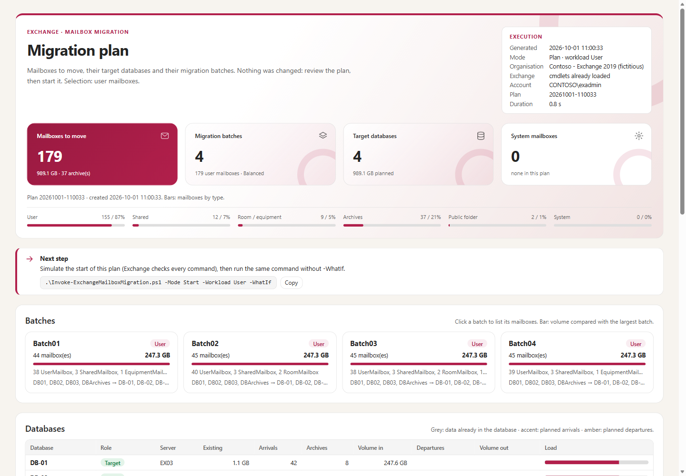
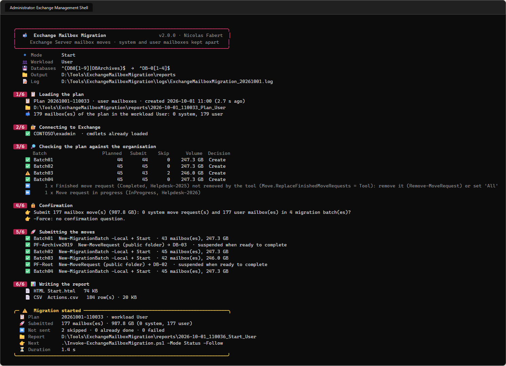

# Exchange Mailbox Migration

> [!IMPORTANT]
> Files downloaded from the Internet may be blocked by Windows and fail to run. Before using this project, unblock every file in the downloaded folder:
>
> ```powershell
> Get-ChildItem "C:\Chemin\Du\Dossier" -Recurse -File -Force | Unblock-File
> ```
>
> Replace the example path with the folder where you downloaded or extracted this project.
>
> If an `Install-Module` command reports that the module already exists, add `-Force`. If the installed version still conflicts, close PowerShell, run `Uninstall-Module <ModuleName> -AllVersions` if appropriate, then install the required version again.

Moves the mailboxes of an **Exchange Server** organisation from source databases to target databases with migration batches — **system and user mailboxes kept apart**, **monitoring mailboxes never moved** — with an HTML and CSV report at every step.



## Why

Replacing mailbox databases (new servers, new storage, new naming) means emptying the old databases: user, shared and resource mailboxes, archives, public folder mailboxes, and the system mailboxes. With hundreds or thousands of mailboxes the moves must be **planned** (target database, balanced batches), **checked** before they start, **followed**, **completed at a chosen time** and **cleaned up** — without ever touching what does not belong to the migration.

## How it works

```
Inventory ──► Plan ──► Start ──► Status ──► Complete ──► Cleanup
(read only)  (read only)  (-WhatIf first)  (-Follow)  (now or -CompleteAfter)  (finished objects only)
```

- **One script, one mode per step**, everything set in one configuration file: which databases are emptied, which are filled, which mailbox types, how many batches.
- **System workload** (arbitration, audit log, discovery): one move request per mailbox, completed automatically. **User workload** (user, shared, room, equipment, linked, public folder mailboxes and archives): local migration batches that stop when synchronised and are completed when you decide.
- **Balanced plan**: target databases by volume (existing data counted), batches of equal volume and size; archive-only and primary-only moves handled explicitly.
- **Safe by design**: pre-flight against the live organisation before any start, confirmation before every change, `-WhatIf` simulation, never touches batches or move requests of other tools, never removes a batch whose moves are not completed, never moves a monitoring mailbox.
- **Reports**: self-contained HTML (filters, details, export) and CSV for every execution; every change command in the log.



## Requirements

| Item | Requirement |
|---|---|
| Exchange | Exchange Server 2019 / Subscription Edition (2016 works: same cmdlets), moves inside one organisation |
| PowerShell | **Windows PowerShell 5.1 only** (Exchange Management Shell, or `powershell.exe`). PowerShell 7 is not supported by Microsoft for Exchange Server management: the script refuses it |
| Permissions | RBAC roles Mail Recipients, Move Mailboxes, Migration, View-Only Configuration (e.g. Organization Management) |
| Console | Windows Terminal for emoji and colours; the classic console shows symbols |

## Quick start

```powershell
git clone https://github.com/Nico77600/ExchangeMailboxMigration.git
cd ExchangeMailboxMigration
notepad .\config\ExchangeMailboxMigration.config.psd1      # Databases: source and target patterns

.\Invoke-ExchangeMailboxMigration.ps1                                   # inventory: changes nothing
.\Invoke-ExchangeMailboxMigration.ps1 -Mode Plan  -Workload System
.\Invoke-ExchangeMailboxMigration.ps1 -Mode Start -Workload System -WhatIf
.\Invoke-ExchangeMailboxMigration.ps1 -Mode Start -Workload System
.\Invoke-ExchangeMailboxMigration.ps1 -Mode Plan  -Workload User
.\Invoke-ExchangeMailboxMigration.ps1 -Mode Start -Workload User
.\Invoke-ExchangeMailboxMigration.ps1 -Mode Status -Follow
.\Invoke-ExchangeMailboxMigration.ps1 -Mode Complete -Batch 01,02 -CompleteAfter '2026-10-03 22:00'
.\Invoke-ExchangeMailboxMigration.ps1 -Mode Cleanup
```

`.\tools\New-EmmPackage.ps1` copies only the files needed to run into `..\package\ExchangeMailboxMigration-<version>`, ready to be zipped and copied to an Exchange server.

## Documentation

The **administrator guide** covers the concepts, installation, configuration, every step with screenshots, recipes, the reports, troubleshooting and the internals:

- [docs/ExchangeMailboxMigration-Guide.md](docs/ExchangeMailboxMigration-Guide.md)
- `docs/ExchangeMailboxMigration-Guide.html` — the same guide as a single HTML file (download it and open it locally)

## Tests

```powershell
# Windows PowerShell 5.1 (powershell.exe), like the tool; Pester 5+ installed (Windows ships 3.4)
Invoke-Pester -Path .\tests                               # no Exchange server needed
powershell.exe -NoProfile -File .\tests\Invoke-EndToEnd.ps1   # whole lifecycle with the real script
```

The tests run against `tests\FakeExchange.ps1`, a fictitious organisation (contoso.com) with the Exchange cmdlets in memory. Only `tools\Build-Documentation.ps1`, which rebuilds the HTML guide on a workstation and never connects to Exchange, needs PowerShell 7.4+.

## License

[MIT](LICENSE).

## Disclaimer

Personal project, provided as is. It is not an official Microsoft product and is not supported by Microsoft. Mailbox moves change production data: run the inventory, review the plan, simulate with `-WhatIf` and test in a lab before production use.
