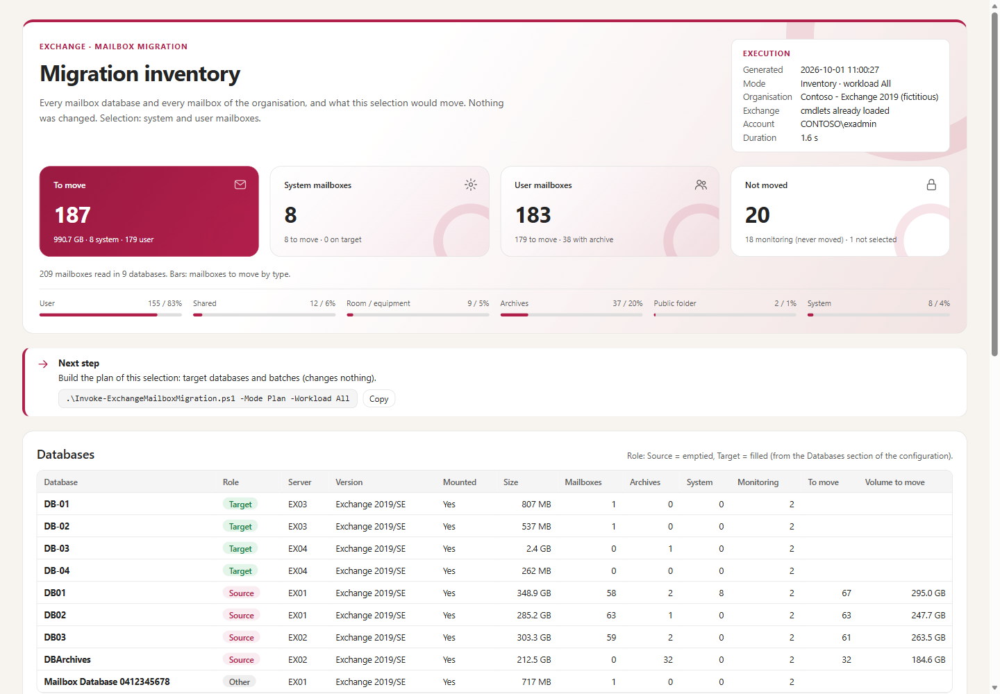
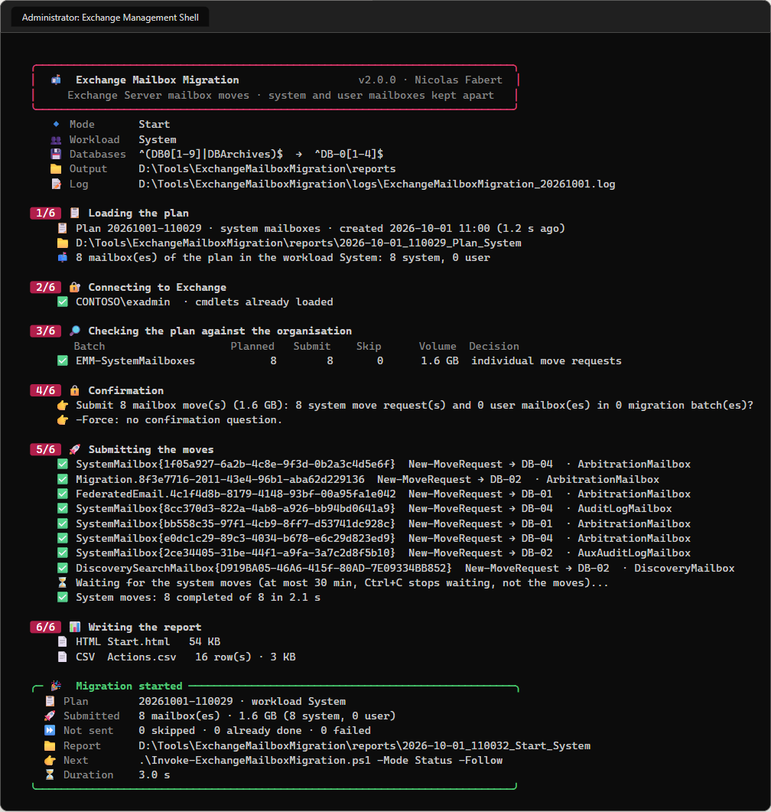
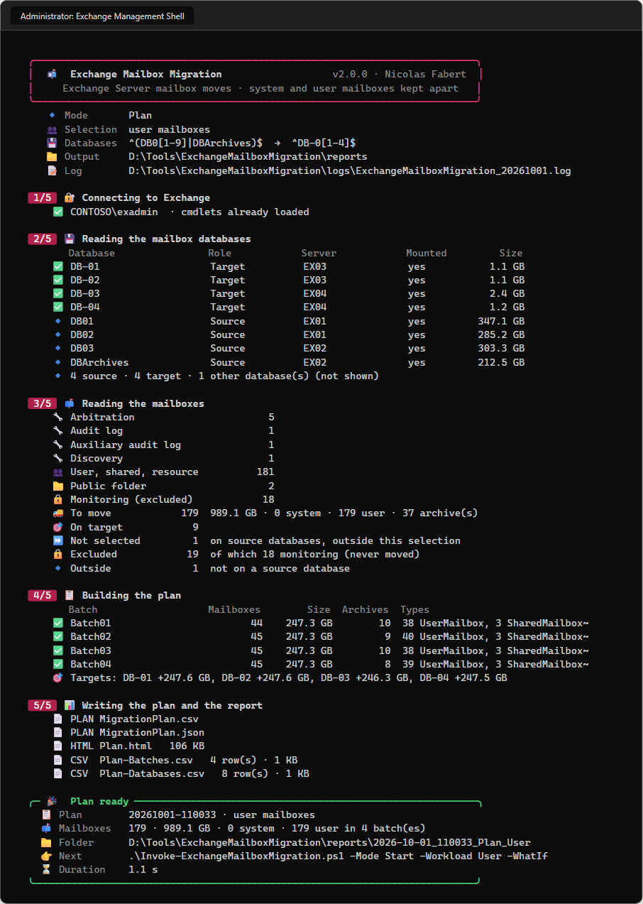
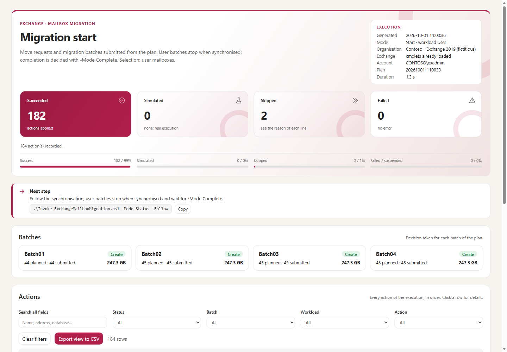
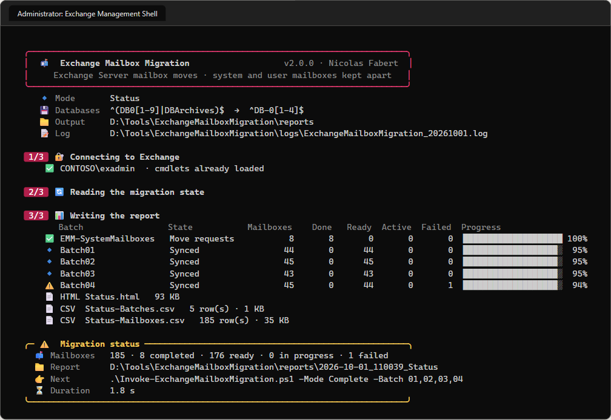
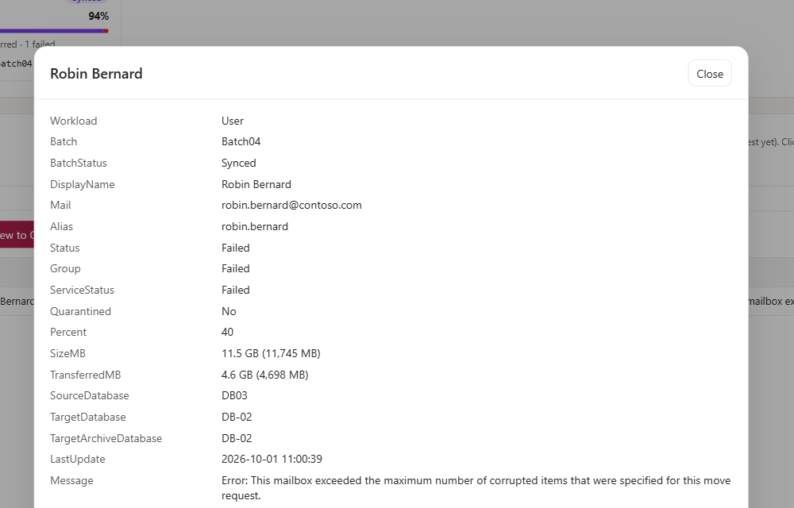
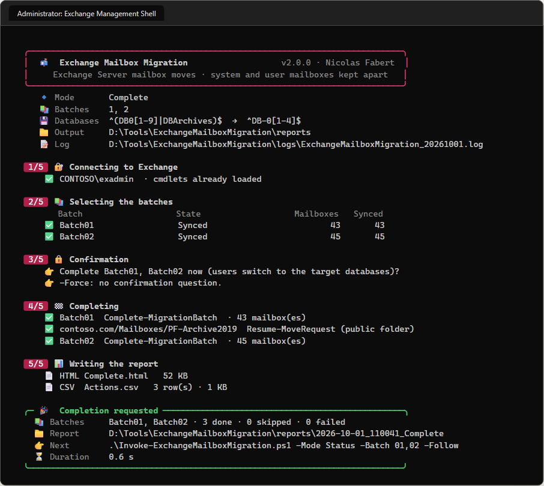
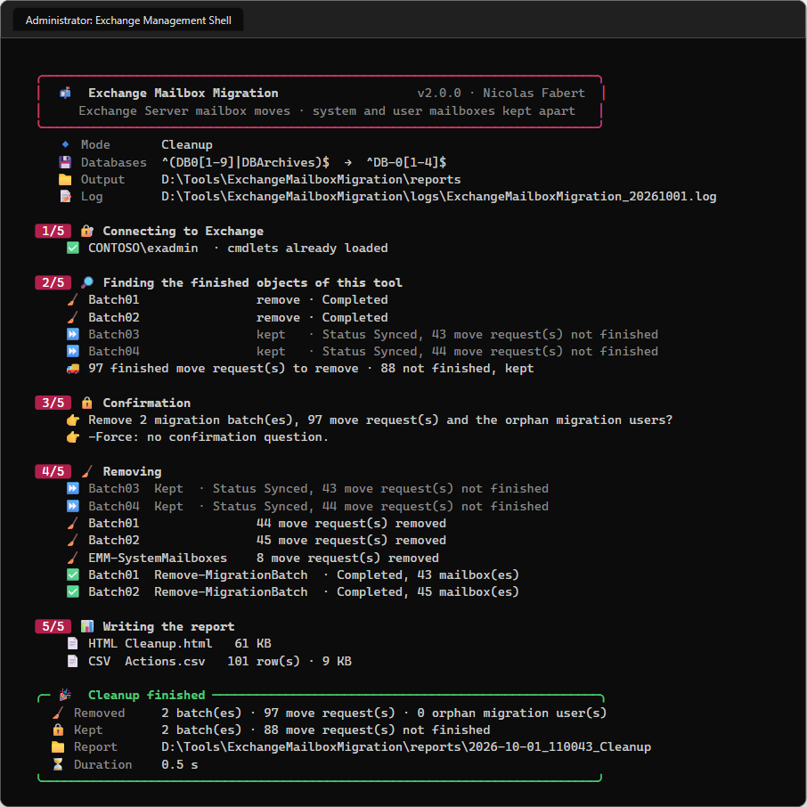

# Exchange Mailbox Migration — Administrator guide

> Moves the mailboxes of an Exchange Server organisation **from source databases to target databases** with migration batches, **system and user mailboxes kept apart**, monitoring mailboxes never moved, with an HTML and CSV report at every step.

```cards
target | What it does | Empties the databases you name (for example `DB01`…`DB09`, `DBArchives`) into the databases you name (`DB-01`…`DB-12`), balanced by volume and by number.
layers | How it moves | **System** mailboxes: one move request each, completed automatically. **User** mailboxes and archives: local migration batches, completed when you decide.
shield | What it never does | Never moves a monitoring mailbox, never touches a batch or a move request it did not create, never removes a batch whose moves are not finished.
file | What it produces | A plan you review before anything happens, and a self-contained HTML report (plus CSV) at every step.
```

## Quick start

```steps
Check the prerequisites | Exchange Management Shell (Windows PowerShell 5.1) or PowerShell 7 on a domain computer, an account with the roles of chapter 5.
Describe your databases | In `config\ExchangeMailboxMigration.config.psd1`, section `Databases`: which databases are emptied, which are filled.
Look before moving | `.\Invoke-ExchangeMailboxMigration.ps1` — the inventory changes nothing and shows how every database and mailbox is classified.
Plan, simulate, start | `-Mode Plan`, then `-Mode Start -WhatIf`, then `-Mode Start`. System mailboxes first (`-Workload System`), then users (`-Workload User`).
Follow, complete, clean | `-Mode Status -Follow`, `-Mode Complete -Batch 01,02` (now or with `-CompleteAfter`), then `-Mode Cleanup`.
```

> [!IMPORTANT]
> Every mode that changes something (**Start**, **Complete**, **Cleanup**) shows what it is going to do and asks for confirmation. `-WhatIf` sends every Exchange command with `-WhatIf`: Exchange checks it, nothing changes. Read-only modes (**Inventory**, **Plan**, **Status**) never change anything.

# Part I · Understand

<!-- icon: book -->
## 1. Project background

**Why this tool**

- Mailbox databases are replaced: new databases (often on new servers or new storage, with a new naming), the old ones must be emptied before they are removed.
- The move concerns **every kind of mailbox**: users, shared and resource mailboxes, archives, public folder mailboxes — and the **system mailboxes** (arbitration, audit log, discovery), which must move too before a database can be removed.
- With hundreds or thousands of mailboxes, the moves must be **planned** (target database, balanced batches), **followed**, **completed at a chosen time** (the switch-over is the only moment users may notice) and **cleaned**.

**What it replaces**

Version 2.0 is a rewrite of the `Migrate-ExchangeBals` script (v1.3/1.4, steps 18 to 22 of an Exchange 2019 deployment framework), aligned with the standards of the author's other tools: one entry point, a configuration file, a modern console, an HTML report, a complete guide and automated tests. Annex B maps the old commands to the new ones and lists the problems fixed.

**Scope**

| Item | Value |
|---|---|
| Exchange | Exchange Server 2019 and Subscription Edition (also 2016: same cmdlets). Moves inside one organisation (local moves). |
| Typical scenario | All servers in Exchange 2019: databases `DB01`…`DB09` + `DBArchives` emptied into `DB-01`…`DB-12`. |
| Also | Moves from Exchange 2016 databases to Exchange 2019 databases of the same organisation. |
| Not covered | Cross-forest or Exchange Online migrations, public folder hierarchy migrations (only public folder **mailboxes** are moved). |

<!-- icon: flow -->
## 2. How it works

One script, one **mode** per step of a migration:

```flow
search | Inventory | read only
arrow | |
file | Plan | read only
arrow | review |
play | Start | -WhatIf first
arrow | sync |
refresh | Status | -Follow
arrow | ready |
check | Complete | now or later
arrow | |
wrench | Cleanup | finished objects
```

| Mode | What it does | Changes |
|---|---|---|
| `Inventory` (default) | Reads every database and every mailbox; shows what the selection would move, what stays and why. | Nothing |
| `Plan` | Chooses the target database(s) and the batch of every mailbox; writes the plan (`MigrationPlan.csv` + `.json`) and its report. | Nothing |
| `Start` | Checks the plan against the organisation **now** (pre-flight), then submits the moves. | Move requests, migration batches |
| `Status` | Real state of the batches and moves of this tool. `-Follow` refreshes it until the end. | Nothing |
| `Complete` | Completes the chosen batches now, or schedules their completion (`-CompleteAfter`). | Completion of moves |
| `Cleanup` | Removes the finished batches, move requests and migration users of this tool. | Removal of finished objects |

**Two workloads**

```cards
gear | System workload | Arbitration, audit log, auxiliary audit log and discovery mailboxes. One `New-MoveRequest` each, labelled `EMM-SystemMailboxes`, **completed automatically**; `-Mode Start` waits for them (30 minutes at most).
people | User workload | User, shared, room, equipment, linked and public folder mailboxes, and **archives**. One local migration batch per plan batch; the moves **stop when synchronised** and wait for `-Mode Complete`.
```

The workload comes from the configuration (`Scope.Workload`, default `All`) or from the command line (`-Workload System | User | All`). A plan made with `All` keeps both apart: `-Mode Start -Workload System` then `-Mode Start -Workload User` submit one part, then the other, from the same plan.

<!-- icon: layers -->
## 3. Mailbox categories

| Category | Types (`RecipientTypeDetails`) | Moved by | Completion |
|---|---|---|---|
| **System** | `ArbitrationMailbox`, `AuditLogMailbox`, `AuxAuditLogMailbox`, `DiscoveryMailbox` | `New-MoveRequest`, one per mailbox | Automatic |
| **User** | `UserMailbox`, `SharedMailbox`, `RoomMailbox`, `EquipmentMailbox`, `LinkedMailbox`, `LinkedRoomMailbox` (and `TeamMailbox`, `SchedulingMailbox` if added) | Local migration batch (`New-MigrationBatch -Local`) | `-Mode Complete` |
| **Archive** | the archive of a user mailbox (pseudo-type `Archive`) | In the batch of its mailbox (`MailboxType` column of the batch CSV) | `-Mode Complete` |
| **Public folder** | `PublicFolderMailbox` | `New-MoveRequest -SuspendWhenReadyToComplete`, labelled with its batch name (a local batch cannot hold it) | `-Mode Complete` (resumed with its batch) |
| **Monitoring** | `MonitoringMailbox` (`HealthMailbox…`) | **Never moved** | — |

**Archives.** For each mailbox the tool decides what moves:

| Move type | When | In the batch CSV |
|---|---|---|
| `Primary` | primary on a source database, no archive | — |
| `PrimaryAndArchive` | primary and archive both on source databases | `PrimaryAndArchive` |
| `PrimaryOnly` | primary on a source database; archive elsewhere (already moved, or archives not selected) | `PrimaryOnly` |
| `ArchiveOnly` | only the archive is on a source database (typical: `DBArchives`) | `ArchiveOnly`, no `TargetDatabase` |

> [!NOTE]
> Without the `MailboxType` column, Exchange moves the primary **and** the archive, and picks a database itself when `TargetDatabase` is empty. That is why the tool always writes the move type and the target database(s) explicitly.

**Monitoring mailboxes** belong to the Managed Availability of each server. They are listed in the inventory as *Excluded* and are never moved, whatever the configuration (a configuration that selects them is refused). They block the removal of an old database: see Annex A, *After the migration*.

<!-- icon: shield -->
## 4. Safety rules

```cards
lock | Never moves monitoring mailboxes | Checked three times: when the mailboxes are read, in the plan, and again just before each submission.
tag | Only its own objects | Batches named `Batch01`… (`Plan.BatchNamePrefix`) and move requests labelled `EMM-SystemMailboxes` (`System.BatchName`). Everything else is counted and left alone.
refresh | Pre-flight before Start | The plan is compared with the organisation **at the time of the start**: deleted or already moved mailboxes, dismounted targets, moves in progress, users already in a batch.
check | No silent loss | A synchronised batch is never removed while its moves are not completed; a batch with failed moves is kept for analysis (unless asked).
search | Simulation | `-WhatIf` on Start, Complete and Cleanup: Exchange validates every command, nothing changes.
file | Audit trail | Every change command is written to the log with its parameters; every execution writes an HTML and CSV report.
```

> [!CAUTION]
> The tool never removes a move request that is **in progress**, never empties the organisation's move requests and never removes a batch it did not create. If a mailbox already has an active move (another tool, another administrator), it is skipped and shown as such.

# Part II · Set up

<!-- icon: checklist -->
## 5. Prerequisites

### Computer

| Item | Requirement |
|---|---|
| PowerShell | **Windows PowerShell 5.1** (Exchange Management Shell) or **PowerShell 7** |
| Where | An Exchange server (recommended: the Exchange Management Shell is there), or a domain computer that can open remote PowerShell to an Exchange server (`http://<server>/PowerShell`, Kerberos) |
| Modules | None to install: the tool uses the Exchange cmdlets |
| Console | Any. Colours and emoji in Windows Terminal; symbols from the console fonts in the classic console |
| To rebuild the guide | PowerShell 7.4+ (`ConvertFrom-Markdown`) — not needed to run the tool |

### Permissions

The account needs the Exchange RBAC roles:

| Role | For |
|---|---|
| **Mail Recipients** | reading mailboxes (`Get-Mailbox`, `Get-MailboxStatistics`) |
| **Move Mailboxes** | `New-MoveRequest`, `Set-`, `Resume-`, `Remove-MoveRequest` |
| **Migration** | `New-`, `Start-`, `Complete-`, `Remove-MigrationBatch`, migration users |
| **View-Only Configuration** | databases and servers (`Get-MailboxDatabase -Status`, `Get-ExchangeServer`) |

*Organization Management* has them all. Remote PowerShell exposes only the cmdlets of the account's roles: when one is missing, the tool stops at the connection step and names the missing cmdlets.

### Before moving data

> [!WARNING]
> **Transaction logs.** A move writes every item into the target database, so its transaction logs grow by about the volume moved. Check the free space of the log volumes of the target databases (or enable circular logging for the duration of the migration, if your backup policy allows it) — the plan report gives the volume planned per target database.

- **Space**: the target databases must hold the volume planned (Plan report, *Databases*: existing + arrivals).
- **Mailbox Replication Service throttling**: moves are queued by the MRS of the target servers; their number in parallel is limited by Exchange. Large batches simply take longer.
- **Backups**: a database being filled has a growing number of logs until the next full backup.

<!-- icon: download -->
## 6. Installation

```powershell
# On the admin workstation: build the package (only the files needed to run)
.\tools\New-EmmPackage.ps1
# -> ..\package\ExchangeMailboxMigration-2.0.0 : zip it and copy it to the Exchange server

# On the Exchange server
Expand-Archive .\ExchangeMailboxMigration-2.0.0.zip -DestinationPath D:\Tools\ExchangeMailboxMigration
Get-ChildItem D:\Tools\ExchangeMailboxMigration -Recurse | Unblock-File   # files downloaded from the internet
cd D:\Tools\ExchangeMailboxMigration
notepad .\config\ExchangeMailboxMigration.config.psd1                   # the Databases section at least
.\Invoke-ExchangeMailboxMigration.ps1                                  # inventory: changes nothing
```

`New-EmmPackage.ps1 -ConfigPath <file>` puts the configuration of an organisation in the package (it is checked first). Keep that file outside the Git repository: the repository only holds the example configuration.

The tool creates `reports\` and `logs\` at the first run. Folder layout:

| Path | Content |
|---|---|
| `Invoke-ExchangeMailboxMigration.ps1` | The only script to run |
| `ExchangeMailboxMigration.psd1` / `.psm1` | The module (manifest, functions) |
| `config\ExchangeMailboxMigration.config.psd1` | The configuration |
| `templates\Report.template.html` | The HTML report page |
| `reports\<date>_<Mode>[_<Workload>]\` | One folder per execution: HTML, CSV, and the plan for `-Mode Plan` |
| `logs\ExchangeMailboxMigration_<date>.log` | One log per day (every change command with its parameters) |

<!-- icon: settings -->
## 7. Configuration

`config\ExchangeMailboxMigration.config.psd1` is a PowerShell data file. Every value is checked at start; all problems are reported together.

### Databases

```powershell
Databases = @{
    SourceDatabasePattern        = '^(DB0[1-9]|DBArchives)$'   # emptied
    TargetDatabasePattern        = '^DB-(0[1-9]|1[0-2])$'      # filled
    ArchiveTargetDatabasePattern = ''                          # dedicated archive databases ('' = none)
    DatabaseMap = @{ }                                         # fixed mapping, e.g. 'DBArchives' = 'DB-10'
    CountExistingData = $true                                  # balance on existing + planned volume
}
```

- A database is a **source** when it matches `SourceDatabasePattern` or is a key of `DatabaseMap`; a **target** when it matches `TargetDatabasePattern` (or `ArchiveTargetDatabasePattern`) or is a value of `DatabaseMap`.
- **A target is never a source**, even if it matches both: the inventory warns about it.
- Patterns are regular expressions: anchor them (`^…$`), otherwise `DB0` also matches `DB01x`.
- Recovery databases are ignored. A target that is not mounted receives nothing (warning).

**Target choice** (per mailbox, largest first): `DatabaseMap` → otherwise the least loaded target. Archives: `DatabaseMap` → `ArchiveTargetDatabasePattern` → the database of their primary mailbox. System mailboxes: `System.TargetDatabase` when set.

### Scope

| Key | Default | Meaning |
|---|---|---|
| `Workload` | `All` | `System`, `User` or `All` (command line `-Workload`) |
| `SystemMailboxTypes` | the four system types | system types moved |
| `UserMailboxTypes` | user, shared, room, equipment, linked, linked room, public folder, `Archive` | user types moved; remove `Archive` to leave archives in place |
| `ExcludeMailboxes` | `@()` | alias, primary SMTP address, name or GUID never moved (VIP freeze, mailbox under investigation…) |

A type found on a source database but not selected is shown as **Not selected** in the inventory: nothing is forgotten silently.

### Plan, moves, system mailboxes

| Section.Key | Default | Meaning |
|---|---|---|
| `Plan.BatchCount` | 12 | number of batches (Balanced) — `-BatchCount` |
| `Plan.BatchStrategy` | `Balanced` | `Balanced` (equal volume and count), `PerSourceDatabase` (one batch per database emptied), `PerTargetDatabase` |
| `Plan.BatchNamePrefix` | `Batch` | batch names `Batch01`…; another prefix per wave keeps waves apart |
| `Plan.MaxPlanAgeDays` | 7 | `-Mode Start` refuses an older plan (`-Force` accepts it) |
| `Move.BadItemLimit` / `LargeItemLimit` | 20 / 0 | corrupted / oversized items tolerated per mailbox. `LargeItemLimit` applies to the individual move requests (system and public folder mailboxes) only: local migration batches have no such setting |
| `Move.AcceptLargeDataLoss` | `$false` | must be `$true` when a limit is 51 or more (Exchange rule) |
| `Move.NotificationEmails` | `@()` | recipients of the batch reports sent by Exchange |
| `Move.ReplaceFinishedMoveRequests` | `Tool` | which **finished** (completed / failed) move requests of planned mailboxes Start may remove so they can move again: `Tool` = only those of this tool, `All` = also those of another origin (old migrations, other administrators), `None` = never (the mailbox is skipped). A request in progress is never removed |
| `System.BatchName` | `EMM-SystemMailboxes` | label of the system move requests |
| `System.TargetDatabase` | `''` | one database for all system mailboxes (`''` = balanced) |
| `System.AllowLargeItems` | `$true` | copy large items of system mailboxes (replaces `LargeItemLimit`) |
| `System.WaitForCompletion` / `WaitTimeoutMinutes` / `PollSeconds` | `$true` / 30 / 30 | `-Mode Start` waits for the system moves |

### Follow-up, cleanup, reports, logs

| Section.Key | Default | Meaning |
|---|---|---|
| `Status.RefreshMinutes` | 2 | interval of `-Follow`; the HTML page reloads at the same pace |
| `Status.OpenReport` | `$true` | `-Follow` opens the report in the browser once |
| `Cleanup.IncludeFailed` | `$false` | also remove failed batches and failed move requests (`-IncludeFailed`) |
| `Cleanup.RemoveOrphanMigrationUsers` | `$true` | migration users left without their batch |
| `Report.OutputPath` | `.\reports` | one folder per execution; plans are kept there (`-OutputPath`) |
| `Report.CsvDelimiter` | `;` | `;` opens directly in Excel with French settings (decimal comma) |
| `Report.Organization` | `''` | shown in the reports |
| `Logging.Path` / `RetentionDays` | `.\logs` / 90 | daily log files |

### Command-line overrides

| Parameter | Modes | Effect |
|---|---|---|
| `-Workload` | all | `System`, `User`, `All` |
| `-MailboxType` | Inventory, Plan | only these types, e.g. `SharedMailbox,RoomMailbox` or `Archive` |
| `-BatchCount` | Plan | number of batches |
| `-PlanPath` | Start | a given plan instead of the latest |
| `-Batch` | Status, Complete, Cleanup | `1`, `03`, `Batch03`, `System` or `All` (required with Complete) |
| `-CompleteAfter` | Complete | `'yyyy-MM-dd HH:mm'` (local time) |
| `-Follow` | Status, Complete | refresh until the batches are finished |
| `-IncludeFailed` | Cleanup | remove failed objects too |
| `-WhatIf` / `-Force` | Start, Complete, Cleanup | simulation / no confirmation question |
| `-ConfigPath`, `-OutputPath`, `-ExchangeServer`, `-Credential` | all | other configuration, output folder, server, account |

# Part III · Use

<!-- icon: play -->
## 8. Step by step

### 1 — Inventory

```powershell
.\Invoke-ExchangeMailboxMigration.ps1
```

Read the console and the report: every database with its role, every mailbox with its decision (*To move*, *On target*, *Not selected*, *Excluded*, *Outside the scope*) and its reason.



> [!TIP]
> Fix the `Databases` section until the roles are right: a database shown as *Other* is ignored; a database that is both source and target is treated as target.

### 2 — System mailboxes first

The migration service keeps its data in an arbitration mailbox: move the system mailboxes **before** the user batches (or after them), not during. `-Mode Start -Workload User` warns while arbitration mailboxes are still on source databases.

```powershell
.\Invoke-ExchangeMailboxMigration.ps1 -Mode Plan  -Workload System
.\Invoke-ExchangeMailboxMigration.ps1 -Mode Start -Workload System -WhatIf
.\Invoke-ExchangeMailboxMigration.ps1 -Mode Start -Workload System
```

The start waits for the moves (30 minutes at most) and reports each result.



### 3 — Plan the user mailboxes

```powershell
.\Invoke-ExchangeMailboxMigration.ps1 -Mode Plan -Workload User
```



The plan report shows the batches (volume, types, source → target), the load of each target database (existing, arrivals, departures) and every mailbox. Click a batch to list its mailboxes.


### 4 — Simulate, then start

```powershell
.\Invoke-ExchangeMailboxMigration.ps1 -Mode Start -Workload User -WhatIf
.\Invoke-ExchangeMailboxMigration.ps1 -Mode Start -Workload User
```

The **pre-flight** compares the plan with the organisation now and decides per mailbox and per batch; the confirmation question gives the totals.


| Pre-flight result | Meaning |
|---|---|
| *Create* | the batch is created |
| *Replace* | a batch of the tool with the same name exists and all its moves are finished (Completed, or *Synced* after `-CompleteAfter`): it is removed first |
| *Skip* (batch) | a batch with the same name exists and is not finished: follow it, or use another prefix |
| *A batch named X exists and does not belong to this tool* | never removed: use another `Plan.BatchNamePrefix` and create a new plan |
| *Move request in progress* | the mailbox is skipped (another move is running) |
| *Finished move request (…) not removed by the tool* | a completed or failed request of another origin blocks the mailbox: remove it (`Remove-MoveRequest`) or set `Move.ReplaceFinishedMoveRequests = 'All'` |
| *Earlier batch X removed first* | the mailbox is still a migration user of an earlier batch of the tool whose moves are all finished (typically a batch left *Synced* after `-CompleteAfter`): Start removes it before creating the new one — same rule as Cleanup, no Cleanup needed |
| *Still a migration user of the batch X (… not finished)* | the earlier batch still has moves to finish (for example a completion scheduled for tonight): the mailbox is skipped, nothing is cancelled |
| *Orphan migration user of X removed first* | a migration user left by a removed batch of the tool is removed before the new batch is created |
| *Moved since the plan* | the mailbox is skipped: create a new plan |
| *Move type reduced* | one part (primary or archive) was already moved: only the other part moves |
| *Target database not available* | failed: the target is missing, dismounted or no longer a target |



### 5 — Follow

```powershell
.\Invoke-ExchangeMailboxMigration.ps1 -Mode Status -Follow
```

`-Follow` rewrites `Status.html` every `Status.RefreshMinutes`; the page reloads itself and keeps its filters. It stops when the selected batches are finished (Ctrl+C stops following, not the migration).




*Ready to complete* = synchronised (95 %), waiting for completion. A **stalled** flag (`StatusDetail` starting with `StalledDueTo…`) means the move waits: busy target disk, quarantine… Click a row for the full message.



### 6 — Complete

```powershell
.\Invoke-ExchangeMailboxMigration.ps1 -Mode Complete -Batch 01,02                       # now
.\Invoke-ExchangeMailboxMigration.ps1 -Mode Complete -Batch All -CompleteAfter '2026-10-03 22:00'
.\Invoke-ExchangeMailboxMigration.ps1 -Mode Complete -Batch 03 -Follow                  # and follow it
```

- **Now**: `Complete-MigrationBatch` (the batch must be *Synced*), then the public folder moves of the batch waiting for completion are resumed. A public folder move that synchronises after its batch is completed is shown *Ready to complete* by Status: run Complete for the batch again (the batch itself is reported *Already done*).
- A batch made only of public folder mailboxes has no migration batch object: Status, Complete and Cleanup handle its labelled move requests the same way.
- **Scheduled**: `Set-MoveRequest -CompleteAfter` + `Resume-MoveRequest` on every move of the batch. Measured on Exchange 2019: `Complete-MigrationBatch` ignores a completion time and finalises at once, so the moves are scheduled one by one. The batch then stays *Synced* in the admin center although its moves complete: `-Mode Status` shows the real state, `-Mode Cleanup` removes it.
- `-Batch System` resumes system moves left suspended (only if you changed their settings).



### 7 — Clean up

```powershell
.\Invoke-ExchangeMailboxMigration.ps1 -Mode Cleanup -WhatIf
.\Invoke-ExchangeMailboxMigration.ps1 -Mode Cleanup
```

You do not need it before moving a mailbox again: Start frees the planned mailboxes itself, with the same rules. Removes, for this tool only: completed batches (and batches left *Synced* after `-CompleteAfter` once all their moves are completed), completed move requests, migration users left without their batch (only those of the batches of this tool, and of the selected batches with `-Batch`). **Kept**: any batch with a move not finished (public folder moves included), and batches holding failed moves (`-IncludeFailed` removes them once the failures are understood).



<!-- icon: lightbulb -->
## 9. Recipes

| I want to… | Do |
|---|---|
| Move the shared and resource mailboxes first | `-Mode Plan -MailboxType SharedMailbox,RoomMailbox,EquipmentMailbox`, then Start. Use another `Plan.BatchNamePrefix` (e.g. `Res`) so the later user batches do not collide. |
| Move only the archives | `-Mode Plan -MailboxType Archive` (archives of every user type, `ArchiveOnly` moves) |
| Leave archives where they are | remove `Archive` from `Scope.UserMailboxTypes` (moves become `PrimaryOnly`) |
| Empty one database at a time | `Plan.BatchStrategy = 'PerSourceDatabase'`: one batch per source database, complete them one by one |
| Force a database mapping | `Databases.DatabaseMap = @{ 'DB01' = 'DB-01'; 'DBArchives' = 'DB-10' }` |
| Put archives on dedicated databases | `Databases.ArchiveTargetDatabasePattern = '^DB-1[0-2]$'` |
| Keep a mailbox out | add it to `Scope.ExcludeMailboxes` |
| Retry a failed mailbox | understand the failure (Status details), raise `Move.BadItemLimit` if relevant, `-Mode Cleanup -IncludeFailed -Batch NN`, then plan and start again (the mailbox is still on its source database) |
| Run unattended | scheduled task: `powershell.exe -NoProfile -File D:\Tools\ExchangeMailboxMigration\Invoke-ExchangeMailboxMigration.ps1 -Mode Status` (read only), or a change mode with `-Force`. Exit codes below. |
| Use another server or account | `-ExchangeServer EX03 -Credential (Get-Credential)` |

<!-- icon: chart -->
## 10. Reading the reports

Every execution writes `<Mode>.html` (self-contained: it can be sent by e-mail) and its CSV files in `reports\<date>_<Mode>[_<Workload>]\`.

| Report | Tiles | Sections | CSV |
|---|---|---|---|
| Inventory | To move, system, user, not moved | databases with role, every mailbox with decision and reason | `Inventory-Databases.csv`, `Inventory-Mailboxes.csv` |
| Plan | mailboxes, batches, targets, system | batches, load of the databases, every mailbox | `MigrationPlan.csv`, `Plan-Batches.csv`, `Plan-Databases.csv` |
| Start / Complete / Cleanup | succeeded, simulated, skipped, failed | decision per batch (Start), every action | `Actions.csv` |
| Status | completed, ready, in progress, failed | batches with progress and next command, every move | `Status-Batches.csv`, `Status-Mailboxes.csv` |

Common features: light/dark theme, *Next step* box with the command to copy, search and filters, sort by clicking a column, details of a row, **Export view to CSV**.

**Sizes** include the recoverable items (what a move copies): they are larger than the "mailbox size" of the admin center. CSV files are UTF-8 with BOM; with the `;` delimiter the decimal separator is a comma (French Excel).

**Status vocabulary**

| Group | Move request statuses |
|---|---|
| Completed | `Completed`, `CompletedWithWarning` |
| Ready to complete | `Synced`, `AutoSuspended` |
| In progress | `Queued`, `InProgress`, `CompletionInProgress` |
| Failed / suspended | `Failed`, `Suspended` |

<!-- icon: terminal -->
## 11. Exit codes and logs

| Code | Meaning |
|---|---|
| 0 | Success |
| 1 | Failure (configuration, connection, unexpected error: see the summary and the log) |
| 2 | Finished with items to look at: Start skipped or failed mailboxes, Complete skipped or failed batches, Status failed moves, Cleanup failed removals (batches kept on purpose are listed but do not change the code) |
| 3 | Cancelled at the confirmation question: nothing changed |

The daily log `logs\ExchangeMailboxMigration_<date>.log` contains every step, every result and **every change command with its parameters** (`[CHANGE]` lines, `[WhatIf]` in simulation), without colours or icons. Keep it with the reports: together they are the audit trail of the migration.

# Part IV · Maintain

<!-- icon: gear -->
## 12. Inside the tool

### Execution flow

```flow
settings | Configuration | checked, overrides
arrow | |
key | Connect | loaded / remote / snap-in
arrow | |
search | Read | databases, mailboxes
arrow | |
file | Decide | plan / pre-flight
arrow | confirm |
play | Act | Exchange commands
arrow | |
chart | Report | HTML + CSV + log
```

**Connection.** The Exchange cmdlets already loaded (Exchange Management Shell) are used as they are; otherwise a remote PowerShell session imports only the cmdlets the tool uses; on an Exchange server without session, the local snap-in. Every value read from Exchange goes through a small adapter (`Get-EmmProp`, `Get-EmmName`, `ConvertTo-EmmMB`, `ConvertTo-EmmMailboxRecord`): the rest of the module works on its own objects, identical with remote PowerShell (deserialized objects, sizes as text) and with the snap-in.

**Sizes.** One `Get-MailboxStatistics -Database` per source database returns every primary and archive mailbox of it, matched by `ExchangeGuid` / `ArchiveGuid` — much faster than one call per mailbox.

**Balancing.** Mailboxes are placed largest first. Targets: the least loaded database (existing data counted when `CountExistingData`). Batches: the batch with the smallest volume among those that can still take a mailbox, with a cap so the counts differ by one at most.

### Code map

| File | Part | Role |
|---|---|---|
| `Invoke-ExchangeMailboxMigration.ps1` | — | Parameters, checks, the steps of each mode, confirmation, summary, exit code. **Start reading here.** |
| `ExchangeMailboxMigration.psm1` | Region 1 · Console and log | Theme (colours, icons, frames), banner, steps, items, tables, summary card, log |
| | Region 2 · Configuration | `Import-EmmConfiguration` (every check), `Resolve-EmmScope` (workload and types) |
| | Region 3 · Exchange connection | `Connect-EmmExchange`, `Disconnect-EmmExchange` |
| | Region 4 · Inventory | database classification, mailbox records, selection rules, sizes, migration objects |
| | Region 5 · Plan | `New-EmmPlan` (targets, batches), summaries, `Save-`/`Import-`/`Find-EmmPlan` |
| | Region 6 · Migration actions | `Get-EmmStartPreflight`, `Start-EmmMigration`, `Complete-EmmBatch`, `Get-EmmCleanupPlan`, `Invoke-EmmCleanup` |
| | Region 7 · Status | `Get-EmmStatus` (move requests + migration users) |
| | Region 8 · Reports | JSON writer, CSV writer, `New-EmmReport` |
| `templates\Report.template.html` | — | The HTML page of every report. The marker `%%DATA%%` receives the data as JSON. |
| `config\…config.psd1` | — | Example configuration |
| `tests\FakeExchange.ps1` | — | Fictitious organisation with the Exchange cmdlets in memory (tests, demonstrations, screenshots) |
| `tools\` | — | `New-EmmPackage.ps1` (delivery), `Build-Documentation.ps1` (this guide in HTML) |

<!-- icon: wrench -->
## 13. Modifying the tool

> [!IMPORTANT]
> Code and comments in **English**, ASCII only in the code files (icons and frames are built from their code points: Windows PowerShell 5.1 reads a file without BOM as ANSI). Keep the header block (author, version) of each file. Update `CHANGELOG.md` and the version (Annex D). Run both test suites (chapter 14) in PowerShell 7 **and** Windows PowerShell 5.1.

| I want to… | Where |
|---|---|
| Add a configuration key | the `.psd1` (with a comment), `Import-EmmConfiguration` (value + check), the guide (chapter 7) |
| Add a mailbox type | `$script:UserTypes` or `$script:SystemTypes` at the top of the module, `typeLabel` in the template; system types also in `Get-EmmMailboxInventory` (how to read them) |
| Change a selection rule | `Set-EmmMailboxSelection` (one place, no Exchange call: test it with Pester) |
| Change target or batch choice | `New-EmmPlan` (`Select-EmmTargetDatabase`, Balanced block) |
| Add a pre-flight check | `Get-EmmStartPreflight`: set `Decision`, `Status`, `Reason` |
| Add a column to a report | the object built in the module (property order = column order), then `columns` of the kind in the template |
| Change the look of the reports | `templates\Report.template.html` only (no rebuild) |
| Change the console output | always through `Write-EmmStep`, `Write-EmmItem`, `Write-EmmTable`, `Write-EmmSummary`: they also write the log |
| Run an Exchange command that changes something | always through `Invoke-EmmChange` (log + `-WhatIf`) and record the result with `Add-EmmAction` |
| Change this guide | `docs\ExchangeMailboxMigration-Guide.md`, then `.\tools\Build-Documentation.ps1` (PowerShell 7.4+) |

### PowerShell pitfalls met during the build

> [!CAUTION]
> **`@()` around a list created with `New-Object` fails** in Windows PowerShell 5.1 and PowerShell 7: `@((New-Object System.Collections.Generic.List[object]))` throws *Argument types do not match* (the list is wrapped in a PSObject). Create lists with `[System.Collections.Generic.List[object]]::new()`.

> [!CAUTION]
> **`.Count` under `Set-StrictMode -Version Latest`** throws on `$null` and on a single object (in 5.1 even on a `[pscustomobject]`). A function or an `if` that returns `@(x)` gives back `x` (the array is unrolled): wrap collections with `@( )` **where they are used**, not only where they are built.

> [!CAUTION]
> **In a .NET regex replacement string, `$'` means "the text after the match"** and `$$` is a dollar sign. A replacement that ends a regular expression with `$` followed by a quote silently inserts the rest of the file (met when the tests rewrite the configuration).

> [!CAUTION]
> **`-WhatIf` on a script** sets `$WhatIfPreference` for every cmdlet of the script, file writing included. The entry script reads it once (simulation), then sets it back to `$false` and passes `-WhatIf` explicitly to the Exchange commands only.

<!-- icon: beaker -->
## 14. Testing a change

```powershell
# Pester 5+ (PowerShell 7): unit rules and integration on the fictitious organisation
Invoke-Pester -Path .\tests\ExchangeMailboxMigration.Tests.ps1 -Output Detailed

# Whole lifecycle with the real entry script, in BOTH PowerShell versions (no Pester needed)
powershell.exe -NoProfile -File .\tests\Invoke-EndToEnd.ps1
pwsh -NoProfile -File .\tests\Invoke-EndToEnd.ps1
```

**47 Pester tests and 47 end-to-end checks, no Exchange server needed.**

```cards
settings | Configuration & scope | Validation, all errors at once, workload and types, `Archive`, monitoring refused.
database | Inventory & plan | Classification, move types, sizes in any regional format, balanced batches, targets, archives and archive policy, plan round trip.
play | Start, complete, cleanup | Simulation, pre-flight, ownership of move requests, batch CSV with `MailboxType`, public folders (with or without batch), idempotent restart, scheduled completion, no lost moves, other origins untouched.
file | Reports & code | JSON safe in `<script>`, CSV for Excel, every file parses, ASCII/BOM, versions aligned.
```

`tests\FakeExchange.ps1` emulates the Exchange cmdlets over a fictitious organisation (Contoso: 4 servers, 9 databases + 1 recovery database, about 200 mailboxes of every type, monitoring mailboxes, archives on a dedicated database, a move in progress of another tool…). `Step-EmmFakeOrg` makes the moves progress. The fake also refuses what Exchange refuses (monitoring mailbox, `AllowLargeItems` with `LargeItemLimit`, `BadItemLimit` ≥ 51 without `AcceptLargeDataLoss`, a user already in a batch) and records every change command, so the tests check what was sent.

> [!NOTE]
> Before a release, also run the tool on a lab organisation: Inventory, Plan, Start `-WhatIf`, then a real small batch through Complete and Cleanup.

# Annexes

<!-- icon: lifebuoy -->
## Annex A — Troubleshooting

### Configuration and connection

| Message | Cause and fix |
|---|---|
| *Invalid configuration … - …* | every problem is listed: fix them all in the `.psd1`, run again |
| *Exchange cmdlets not available to this account: …* | missing RBAC roles (chapter 5); the listed cmdlets tell which |
| *Cannot open remote PowerShell to …* | server name, Kerberos (run on a domain computer, use the FQDN), WinRM; or run on the Exchange server in the Exchange Management Shell |
| *No source database* / *No target database* | patterns or map do not match any database: run `-Mode Inventory` and read the roles |
| Strange characters in the console | classic console without UTF-8 font: `$env:EMM_ICONS = 'Ascii'` (or `Symbols`); `NO_COLOR=1` removes colours |

### Plan and start

| Situation | Explanation |
|---|---|
| A mailbox is *Not selected* | its type is not in the selection (`Scope.*MailboxTypes`, `-MailboxType`, `-Workload`) |
| A mailbox is *Outside the scope* | it is on a database that is neither source nor target |
| *The plan is N day(s) old* | create a new plan (recommended) or use `-Force` |
| *The plan was made with Plan.BatchNamePrefix = …* / *batch name that is not a name of this tool* | the naming changed since the plan, or the plan file was edited: create a new plan (the tool only manages names it recognises) |
| *Batch X already exists (Syncing)* | it is running: follow it; for a new wave use another `Plan.BatchNamePrefix` |
| *Still a migration user of the batch X* | that earlier batch still has moves to finish (scheduled completion, synchronisation): let it finish or complete it, then start again — Start removes it by itself once its moves are finished |
| *Target database … is not available* | dismounted or renamed since the plan: mount it or create a new plan |
| A system move is still running after 30 min | it continues in Exchange: follow it with `-Mode Status -Batch System` |

### Status and completion

| Situation | Explanation |
|---|---|
| Batch *Syncing* although all its moves are *Synced* | the migration service refreshes the batch status by cycles, sometimes with a long delay. Wait and run Status again; the scheduled completion (`-CompleteAfter`) accepts a *Syncing* batch because it works move by move. Field observation (Exchange 2019 lab): restarting the *Microsoft Exchange Replication* service refreshed a status blocked for hours, restarting the Mailbox Assistants did not — on a DAG member, do it at a quiet time. |
| *Exchange completes only a Synced batch* | the batch is not synchronised yet: follow it |
| A move is *stalled* | `StatusDetail` `StalledDueToTarget_DiskLatency`, `…_MdbReplication`, `…_ContentIndexing`…: Exchange protects the target; the move resumes by itself. Check the health of the target database copies. `Get-MoveRequestStatistics <id> -IncludeReport` gives the history. |
| A move *Failed* (too many bad items) | see the message (Status details). Raise `Move.BadItemLimit` if acceptable, then retry (chapter 9). |
| The batch stays *Synced* in the admin center after a scheduled completion | expected (chapter 8, step 6): `-Mode Status` shows the moves completed, `-Mode Cleanup` removes the batch |

### After the migration

1. `-Mode Inventory`: every mailbox should be *On target*; only monitoring mailboxes remain on the source databases.
2. `-Mode Cleanup` (and `-IncludeFailed` once failures are handled).
3. **Monitoring mailboxes** on the old databases block `Remove-MailboxDatabase`. They are not data: Managed Availability recreates them on the remaining databases. The tool never touches them; when you are ready to remove a database:

```powershell
Get-Mailbox -Monitoring -Database DB01 | Disable-Mailbox -Confirm:$false
# Recreated automatically on the other databases by the Microsoft Exchange Health Manager service
```

4. Check that no other object remains on the database (`Get-Mailbox -Database DB01 -Arbitration`, `-AuditLog`, `-PublicFolder`, and `Get-MailboxStatistics -Database DB01` for disconnected mailboxes), then remove it.

<!-- icon: compare -->
## Annex B — From Migrate-ExchangeBals 1.x

### Commands

| Version 1 (`Migrate-ExchangeBals.ps1`) | Version 2 (`Invoke-ExchangeMailboxMigration.ps1`) |
|---|---|
| `-Mode Inventory` | `-Mode Inventory` |
| `-Mode PlanOnly` (steps 18 + 19 in simulation) | `-Mode Plan` (and `-Mode Start -WhatIf`) |
| `-Mode Simulate` | `-WhatIf` with Start, Complete, Cleanup |
| `-Mode Execute` (steps 18 → 22 chained) | separate modes on purpose: Start (System, then User), Status, Complete, Cleanup |
| Step 18 (system mailboxes) | `-Workload System` |
| Step 19 (plan) | `-Mode Plan` |
| Step 20 (move requests / batches) | `-Mode Start -Workload User` |
| `$env:FOLLOW`, `$env:FOLLOW_INTERVAL` | `-Mode Status -Follow`, `Status.RefreshMinutes` |
| Step 21 + `-BatchNumber` / `$env:BATCH` | `-Mode Complete -Batch` |
| `$env:SCHEDULE_TIME` | `-CompleteAfter` |
| Step 22 + `CLEANUP_INCLUDE_FAILED` | `-Mode Cleanup` + `Cleanup.IncludeFailed` / `-IncludeFailed` |
| `-DatabaseMigrationMapCsv` | `Databases.DatabaseMap` |
| `-SourceDatabasePattern`, `-TargetDatabasePattern` | `Databases.*` (configuration file) |
| `-BatchCountOverride` | `-BatchCount` |
| `-BadItemLimitOverride` | `Move.BadItemLimit` |
| `-DefaultExchangeServer` | `-ExchangeServer` / `Connection.ExchangeServer` |
| `Configs\Deployment.config.psd1` (section `Migration`) | `config\ExchangeMailboxMigration.config.psd1` |

Batches created by version 1 (`Batch01`…) follow the default prefix: Status, Complete and Cleanup of version 2 recognise them. System move requests of version 1 have no label: version 2 does not see them as its own and never removes them — a mailbox that still has one is skipped by Start until it is removed (or with `Move.ReplaceFinishedMoveRequests = 'All'`).

### What changed in the behaviour

| Version 1 | Version 2 |
|---|---|
| Step 20 removed every move request of the organisation and every `BatchNN` batch before submitting, so that mailboxes already moved could be moved again (Exchange refuses a mailbox that still has a move request or is still in a batch) — but also moves in progress and objects of other origins | Same intent, targeted: Start frees only the planned mailboxes — their finished move requests, the finished earlier batch that still holds them, orphan migration users — with the rule of Cleanup; moves in progress and objects of other origins are never touched |
| Step 22 removed *Synced* batches: needed on-premises, because moves completed with `Set-MoveRequest -CompleteAfter` leave their batch *Synced* for ever — but also before the scheduled time, which cancelled the scheduled completion | Same intent, checked: a *Synced* batch is removed once all its moves are completed, never before |
| Public folder moves used `New-MoveRequest -PublicFolder` (no such parameter) and were never resumed by step 21 | Plain `New-MoveRequest -SuspendWhenReadyToComplete`, resumed by `-Mode Complete` |
| Archive-only moves: CSV without `MailboxType` (primary moved too, to a database chosen by Exchange) | `MailboxType` and targets always written; primary-only and archive-only moves |
| Plan and execution disagreed on archive targets (map ignored for archives at submission) | One target choice, in the plan; the start uses the plan |
| Primary and archive were balanced as separate rows, then regrouped (unbalanced batches) | One row per mailbox (both parts), balancing on the moved volume |
| Step 18: `BadItemLimit 100` without `AcceptLargeDataLoss` (refused by Exchange) | Limits from the configuration, `AcceptLargeDataLoss` checked |
| Follow-up and scheduled completion only through environment variables; HTML pointed to another script | Real parameters, next commands in every report |
| Automatic map "guessed" from the patterns (digits) | Explicit `DatabaseMap`, or balancing |
| Sizes without recoverable items | Items + recoverable items (what is moved) |

<!-- icon: terminal -->
## Annex C — Exchange commands used

| Command | Mode | Changes |
|---|---|---|
| `Get-ExchangeServer`, `Get-MailboxDatabase -Status` | Inventory, Plan, Start | — |
| `Get-Mailbox` (`-Arbitration`, `-AuditLog`, `-AuxAuditLog`, `-PublicFolder`, `-Monitoring`, `-RecipientTypeDetails DiscoveryMailbox`) | Inventory, Plan, Start | — |
| `Get-MailboxStatistics -Database` | Inventory, Plan | — |
| `Get-MoveRequest`, `Get-MoveRequestStatistics`, `Get-MigrationBatch`, `Get-MigrationUser` | all | — |
| `New-MoveRequest` | Start (system mailboxes, public folder mailboxes) | yes |
| `New-MigrationBatch -Local`, `Start-MigrationBatch` | Start (user mailboxes) | yes |
| `Remove-MoveRequest` | Start (finished request of a planned mailbox), Cleanup | yes |
| `Remove-MigrationBatch` | Start (finished batch with the same name), Cleanup | yes |
| `Complete-MigrationBatch`, `Resume-MoveRequest`, `Set-MoveRequest -CompleteAfter` | Complete | yes |
| `Remove-MigrationUser` | Cleanup (orphans) | yes |

<!-- icon: tag -->
## Annex D — Versioning and release checklist

Versions follow MAJOR.MINOR.PATCH: MAJOR for a change of behaviour or of the configuration format, MINOR for a feature, PATCH for a fix.

```steps
Version | Same number in `ExchangeMailboxMigration.psd1` (`ModuleVersion`), the headers of the `.psm1`, the script, the configuration, the template, the tools and the guide front matter. A test checks the main ones.
Changelog | `CHANGELOG.md`: Added / Changed / Fixed, with the reason.
Tests | Pester (PowerShell 7) and `Invoke-EndToEnd.ps1` in **both** PowerShell versions.
Guide | `docs\ExchangeMailboxMigration-Guide.md`, then `.\tools\Build-Documentation.ps1`. Screenshots from the fictitious organisation only.
Package | `.\tools\New-EmmPackage.ps1`, zip, test on a lab.
Publish | Commit, tag `vX.Y.Z`, push; GitHub release with the zip of the package.
```

> [!WARNING]
> **Before publishing**: the repository holds only fictitious data (contoso.com) and the example configuration. Never commit a real configuration, reports, plans or logs (they contain mailbox names and addresses): `.gitignore` excludes `reports\` and `logs\`; keep organisation configurations outside the repository (`New-EmmPackage.ps1 -ConfigPath`).
